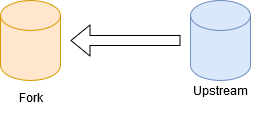
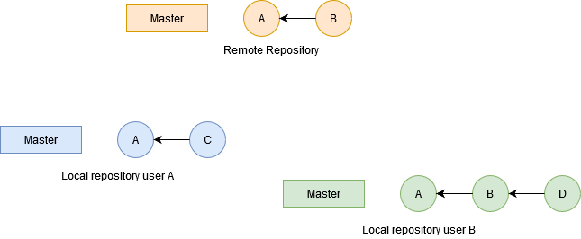
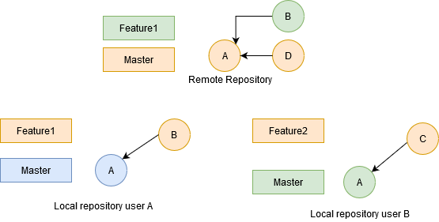
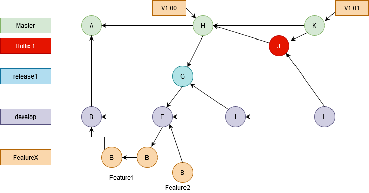

# version-control-git-course

## Pull Requests
The Pull Requests ist a feature of Git hosting site.The ultimate goal is to merge a branch into the project. Enable team communication related to the work of the branch.
* Notifications sent to team members
* Feedback or comments
* Approval of content(code review)

There are two basic repository configurations related to pull request. 
* The first is a single remote repository. A pull request is a single repository configuration.
* The second configuration involves two remote repositories , in this case a pull request is a request to merge a branch from a forked repository into the upstream repository. 

The second approach is common if the submitter doesn't have write access to the upstream repository. 

### When open a pull request?
* when the branch is created (enable the team to begin discussion on the work of the branch immediately)
* when you want comments on the branch
* when the branch is ready for review/merging

## Pull Request Single Repository
1- Create a feature branch (`git checkout -b "featureX"`)

2- Optionally work on the feature branch
* `git touch fileA.txt`
* `git add fileA.txt`
* `git commit -m "added featureX"`

3- Push the branch to the remote repository
(`git push --set-upstream origin featureX`)

4- Deleting Remote Branch Labels
* `git push -d origin featureX`

## Merge strategy for Pull Request
* **Merge commit**: the merge creates a separate commit object
( `git merge --no-ff`)
* **Squash**: the entire branch is condensed to one linear commit(` git merge --squash`)

## Pull Request Multi Repository
### Forking
* Forking copying a remote repository to your own online account
* Both repositories are remote repositories
* The `upstream` repository is usually the source

### Multirepository Pull Requests
1- Fork the upstream repository

2- Create a branch

3- Create a pull request

## Git Flows
### Centralized WorkFlow
A centralized workflow use a single branch to accomplish the work of the project, event though this workflow is very simple. In the bellow example, the remote repository contains two commits. The Developer A cloned, fetched, or pulled when remote repository only had commit A. They then created commit C, now if the Developer A want to add commit C to the remote repository this user would have to pull or fetch and merge before pushing commit C. However the Developer B currently has both commits from the remote repository and would be able to push to the remote repository with no problem.

A down side of the centralized workflow is that you are not taking advantage of the features related to branching such as pull requests.

### Feature Branch WorkFlow
In a feature Branch workflow, the work of the project is done in features, or topic branches. The Feature branch workflow uses a single remote repository, where the team members create feature branches and can submmit their work using pull requests. 

### Forking WorkFlow
The forking workflow involves multiple remote repositories, one of the repositories is considered upstream from the other. The upstream repository is considered the source of truth for the project. One advantage of this workflow is that the user of the forked repository does not need to have right access to the upstream repository, this is because a user on the upstream repository merges the pull request, because of this, the forking workflow is very common in open source projects. 
* multiple remote repositories
* pull request/discussion
* don't need write access on upstream
* back up you work in progress
* can rebase you forked branch
* must synchronize with upstream

### GitFlow WorkFlow
Git flow is a workflow that allows safe continuos releases of the project. It allows work to continue event through releases and hotfixes. The general idea are used in specific ways that depend on the team and the type of project.

The GitFlow Workflow I'll to explain in the next section:
* The initial commit of the project is created on the master branch.
* The develop branch is created off of the master branch. The commit B is the first commit on the develop branch.
* The first release of the project has been planned to have only a single feature. In this case we have created feature1 branch off of commit B. Now we begins work and creates commit C.
* When the team decide that the feature1 is ready. A merged commit E is created, adding feature 1 to the project. Then feature1 branch label  can be deleted.
* Team decides commit E is a release candidate:
    * Create a **release1** branch off of commit E(no commits yet)
    * Create **feature2** branch and creates commit F
* Team discovers a bug in commit E
    * Creates commit G on the **release1** branch
    * Commit G is approved
    * Tag commit H with **v1.00**
    * Create merge commit I on develop to incorporate bug fix from commit G
    * **release1** branch label can be removed
* Team discovers a problem with version **v1.00**:
    * Create **hotfit1** branch
    * Create commit J to fix the issue
    * Hotfit(J) is merged into master
    * Tag ***v1.01** placed on commit K
    * Hotfix(J) is merged into develop(L)
    * **hotfix1** branch label can be deleted

#### GitFlow Merging Rules
* Only merge commits on master
* Commit to master only from a release or hotfix branch
* Commit to master, also merge into the develop branch